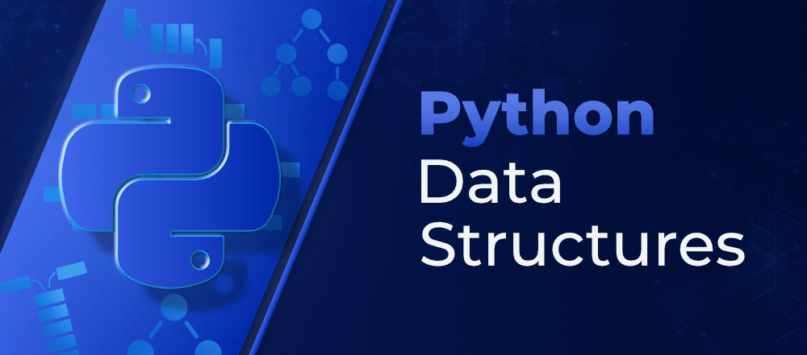

# My Python Data Structures Project

## Authors
- [@Sassi Hamdi](https://twitter.com/sassi_hamdi_)

This project is a collection of Python solutions for various tasks related to data structures like lists and tuples. It is part of the ALX Higher Level Programming curriculum.

Add badges from somewhere like: [shields.io](https://shields.io/)

[](http://www.gnu.org/licenses/agpl-3.

## Learning Objectives

By completing the tasks in this project, you will:

- Understand the power and versatility of Python programming.
- Gain a deeper understanding of lists and their similarities and differences with strings.
- Learn and utilize common methods of lists.
- Implement lists as stacks and queues.
- Master list comprehensions for concise and efficient code.
- Understand tuples and their usage compared to lists.
- Explore the concept of sequence packing and unpacking in tuples.
- Learn to use the `del` statement effectively.

## Resources

To successfully complete this project, it is recommended to read or watch the following resources:

- [3.1.3. Lists](https://docs.python.org/3/tutorial/introduction.html#lists)
- [Data structures](https://docs.python.org/3/tutorial/datastructures.html) (until 5.3. Tuples and Sequences included)
- [Learn to Program 6: Lists](https://www.youtube.com/watch?v=A1HUzrvS-Pw)

## Requirements

### Python Scripts

- Allowed editors: vi, vim, emacs, [Insert Preferred Editor]
- All files will be interpreted/compiled on [Insert Operating System and Version] using python3 (version [Insert Python Version])
- All files should end with a new line.
- The first line of all files should be exactly `#!/usr/bin/python3`.
- A `README.md` file, at the root of the project folder, is mandatory.
- Code should follow the [Insert Preferred Style Guide] style guide (version [Insert Style Guide Version]).
- All files must be executable.
- The length of your files will be tested using `wc`.

### C

- Allowed editors: vi, vim, emacs, [Insert Preferred Editor]
- All files will be interpreted/compiled on [Insert Operating System and Version].
- All files should end with a new line.
- Code should use the [Insert Preferred Style Guide] style guide. It will be checked using `betty-style.pl` and `betty-doc.pl`.
- You are not allowed to use global variables.
- No more than 5 functions per file.
- Prototypes of all functions should be included in a header file called `lists.h`.
- Don't forget to push your header file.
- All header files should be include guarded.

## Task List

1. [Print a list of integers](#1-print-a-list-of-integers)
2. [Secure access to an element in a list](#2-secure-access-to-an-element-in-a-list)
3. [Replace an element](#3-replace-an-element)
4. [Print a list of integers in reverse](#4-print-a-list-of-integers-in-reverse)
5. [Replace elements in a copy](#5-replace-elements-in-a-copy)
6. [Can you "C" me now?](#6-can-you-c-me-now)
7. [Lists of lists = Matrix](#7-lists-of-lists-matrix)

## Customization

the appropriate information:

- vim, emacs
- Linux Ubuntu 22.04.2 LTS
- Python 3.10.6
- pycodestyle
- 2.10.0

## Used By

This projects is used by the following companies:

- Holberton School
- ALX Africa

## Feedback

If you have any feedback, please reach out to us at sassihamdi7@gmail.com
